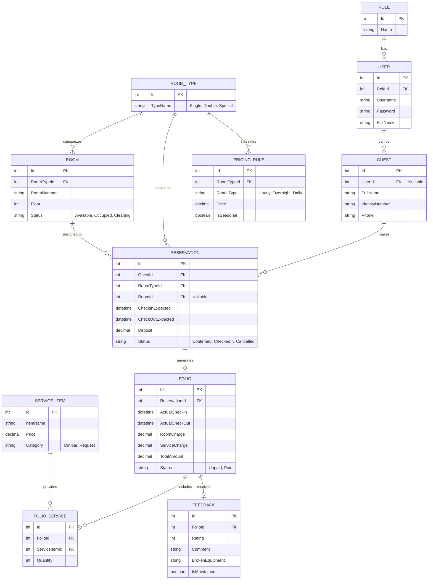

# Giai đoạn 1: Thiết kế Cơ sở dữ liệu (Database Design)

Đây là tài liệu thiết kế CSDL (Database Schema) dành riêng cho SQL Server. Thiết kế này tối ưu hóa cho các nghiệp vụ: Đặt đích danh/Đặt loại phòng, Tính giá linh hoạt và Quản lý bảo trì thiết bị.

## User Review Required
> [!IMPORTANT]
> Đây là bản thiết kế Database (Giai đoạn 1) ĐÃ CẬP NHẬT. Đã bổ sung script tạo Seed Data và Stored Procedure tính tiền. Nếu bạn đồng ý, hãy bấm Proceed để tôi tiếp tục sang Giai đoạn 3 (Code API).

## 1. Sơ đồ thực thể liên kết (ERD)



## 2. Kịch bản DDL (SQL Server)

Dưới đây là Script tạo bảng để bạn có thể chạy trực tiếp trong SQL Server Management Studio (SSMS).

```sql
-- Tạo Database
CREATE DATABASE HotelManagement;
GO
USE HotelManagement;
GO

-- 1. Bảng Phân Quyền
CREATE TABLE Roles (
    Id INT IDENTITY(1,1) PRIMARY KEY,
    Name NVARCHAR(50) NOT NULL -- Admin, Owner, Receptionist, Housekeeping, Customer
);

-- 2. Bảng Người Dùng (Nhân viên & Khách có tài khoản)
CREATE TABLE Users (
    Id INT IDENTITY(1,1) PRIMARY KEY,
    RoleId INT NOT NULL FOREIGN KEY REFERENCES Roles(Id),
    Username VARCHAR(50) NOT NULL UNIQUE,
    Password VARCHAR(255) NOT NULL,
    FullName NVARCHAR(100) NOT NULL,
    Phone VARCHAR(20),
    IsActive BIT DEFAULT 1
);

-- 3. Bảng Khách Hàng (Lưu trú thực tế)
CREATE TABLE Guests (
    Id INT IDENTITY(1,1) PRIMARY KEY,
    UserId INT NULL FOREIGN KEY REFERENCES Users(Id), -- Khách vãng lai không cần UserId
    FullName NVARCHAR(100) NOT NULL,
    IdentityNumber VARCHAR(20) NOT NULL,
    Phone VARCHAR(20)
);

-- 4. Bảng Loại Phòng
CREATE TABLE RoomTypes (
    Id INT IDENTITY(1,1) PRIMARY KEY,
    TypeName NVARCHAR(50) NOT NULL -- Phòng Đơn, Phòng Đôi, Phòng Đặc Biệt
);

-- 5. Bảng Phòng
CREATE TABLE Rooms (
    Id INT IDENTITY(1,1) PRIMARY KEY,
    RoomTypeId INT NOT NULL FOREIGN KEY REFERENCES RoomTypes(Id),
    RoomNumber VARCHAR(10) NOT NULL UNIQUE,
    FloorNumber INT NOT NULL,
    Status VARCHAR(20) DEFAULT 'AVAILABLE' -- AVAILABLE, OCCUPIED, CLEANING, MAINTENANCE
);

-- 6. Bảng Giá (Dynamic Pricing)
CREATE TABLE PricingRules (
    Id INT IDENTITY(1,1) PRIMARY KEY,
    RoomTypeId INT NOT NULL FOREIGN KEY REFERENCES RoomTypes(Id),
    RentalType VARCHAR(20) NOT NULL, -- HOURLY_FIRST, HOURLY_NEXT, OVERNIGHT, DAILY
    Price DECIMAL(18,0) NOT NULL,
    IsSeasonal BIT DEFAULT 0, -- 1 nếu là giá lễ tết/mùa cao điểm
    EffectiveDate DATETIME DEFAULT GETDATE(),
    IsActive BIT DEFAULT 1
);

-- 7. Bảng Đặt Phòng (Reservation)
CREATE TABLE Reservations (
    Id INT IDENTITY(1,1) PRIMARY KEY,
    GuestId INT NOT NULL FOREIGN KEY REFERENCES Guests(Id),
    RoomTypeId INT NOT NULL FOREIGN KEY REFERENCES RoomTypes(Id),
    RoomId INT NULL FOREIGN KEY REFERENCES Rooms(Id), -- Null nếu chỉ đặt loại phòng
    CheckInExpected DATETIME NOT NULL,
    CheckOutExpected DATETIME NOT NULL,
    DepositAmount DECIMAL(18,0) DEFAULT 0,
    Status VARCHAR(20) DEFAULT 'CONFIRMED', -- CONFIRMED, CHECKED_IN, CANCELLED
    CreatedAt DATETIME DEFAULT GETDATE()
);

-- 8. Bảng Hồ Sơ Lưu Trú (Folio - Hóa đơn gốc)
CREATE TABLE Folios (
    Id INT IDENTITY(1,1) PRIMARY KEY,
    ReservationId INT NOT NULL FOREIGN KEY REFERENCES Reservations(Id),
    ActualCheckIn DATETIME NOT NULL,
    ActualCheckOut DATETIME NULL,
    RoomCharge DECIMAL(18,0) DEFAULT 0,
    ServiceCharge DECIMAL(18,0) DEFAULT 0,
    TotalAmount DECIMAL(18,0) DEFAULT 0,
    Status VARCHAR(20) DEFAULT 'UNPAID' -- UNPAID, PAID
);

-- 9. Bảng Dịch Vụ / Hàng Hóa
CREATE TABLE ServiceItems (
    Id INT IDENTITY(1,1) PRIMARY KEY,
    ItemName NVARCHAR(100) NOT NULL,
    Price DECIMAL(18,0) NOT NULL,
    Category VARCHAR(20) -- MINIBAR (Nước, mì), REQUEST (Khăn tắm, BCS...)
);

-- 10. Bảng Chi Tiết Dịch Vụ Của Hóa Đơn
CREATE TABLE FolioServices (
    Id INT IDENTITY(1,1) PRIMARY KEY,
    FolioId INT NOT NULL FOREIGN KEY REFERENCES Folios(Id),
    ServiceItemId INT NOT NULL FOREIGN KEY REFERENCES ServiceItems(Id),
    Quantity INT NOT NULL,
    Price DECIMAL(18,0) NOT NULL, -- Lưu giá tại thời điểm mua
    Status VARCHAR(20) DEFAULT 'DELIVERED'
);

-- 11. Bảng Đánh Giá & Báo Hỏng
CREATE TABLE Feedbacks (
    Id INT IDENTITY(1,1) PRIMARY KEY,
    FolioId INT NOT NULL FOREIGN KEY REFERENCES Folios(Id),
    Rating INT CHECK (Rating >= 1 AND Rating <= 5),
    Comment NVARCHAR(MAX),
    BrokenEquipment NVARCHAR(255), -- Khách báo hỏng vòi sen, cháy đèn...
    IsMaintained BIT DEFAULT 0, -- 1: Đã bảo trì, 0: Chưa bảo trì
    CreatedAt DATETIME DEFAULT GETDATE()
);
```

## 3. Script Khởi tạo Dữ liệu mẫu (Seed Data)
Các dòng lệnh sau sẽ thêm Admin và thiết lập sơ đồ 15 phòng như yêu cầu.

```sql
-- ==============================================
-- 12. Kịch bản tạo Dữ liệu mẫu (Seed Data)
-- ==============================================
USE HotelManagement;
GO

-- 12.1. Seed Data: Roles
INSERT INTO Roles (Name) VALUES 
('Admin'), ('Owner'), ('Receptionist'), ('Housekeeping'), ('Customer');
GO

-- 12.2. Seed Data: User Admin (Mật khẩu nên được mã hóa trong Java sau này)
INSERT INTO Users (RoleId, Username, Password, FullName, Phone, IsActive)
VALUES (1, 'admin', 'admin123', N'Quản trị viên', '0901234567', 1);
GO

-- 12.3. Seed Data: Room Types
INSERT INTO RoomTypes (TypeName) VALUES 
(N'Phòng Đơn'), (N'Phòng Đôi'), (N'Phòng Đặc Biệt');
GO

-- 12.4. Seed Data: Rooms (15 phòng, 5 tầng)
INSERT INTO Rooms (RoomTypeId, RoomNumber, FloorNumber, Status) VALUES 
(1, '101', 1, 'AVAILABLE'), (1, '102', 1, 'AVAILABLE'), (2, '103', 1, 'AVAILABLE'),
(1, '201', 2, 'AVAILABLE'), (1, '202', 2, 'AVAILABLE'), (2, '203', 2, 'AVAILABLE'),
(1, '301', 3, 'AVAILABLE'), (2, '302', 3, 'AVAILABLE'), (3, '303', 3, 'AVAILABLE'), 
(1, '401', 4, 'AVAILABLE'), (2, '402', 4, 'AVAILABLE'), (3, '403', 4, 'AVAILABLE'),
(1, '501', 5, 'AVAILABLE'), (2, '502', 5, 'AVAILABLE'), (3, '503', 5, 'AVAILABLE');
GO
```

## 4. Stored Procedure: Xử lý Tính Tiền Phòng

Theo yêu cầu: Tính tiền dựa trên tham số đầu vào là giá giờ đầu (do hệ thống/quản lý quy định) và giá giờ sau (do lễ tân xác nhận), rồi nhân với thời gian ở thực tế.

```sql
-- ==============================================
-- 13. Stored Procedure: Tính tiền phòng theo giờ
-- ==============================================
IF OBJECT_ID('sp_CalculateRoomCharge_Hourly', 'P') IS NOT NULL
    DROP PROCEDURE sp_CalculateRoomCharge_Hourly;
GO

CREATE PROCEDURE sp_CalculateRoomCharge_Hourly
    @FolioId INT,
    @FirstHourPrice DECIMAL(18,0),  -- Ví dụ: 50.000 (Nhập từ giao diện)
    @NextHourPrice DECIMAL(18,0)    -- Ví dụ: 10.000 (Nhập từ giao diện)
AS
BEGIN
    SET NOCOUNT ON;
    
    DECLARE @ActualCheckIn DATETIME;
    DECLARE @ActualCheckOut DATETIME;
    DECLARE @TotalMinutes INT;
    DECLARE @TotalHours INT;
    DECLARE @RoomCharge DECIMAL(18,0) = 0;

    -- Lấy thời gian Check-in và Check-out thực tế
    SELECT @ActualCheckIn = ActualCheckIn, @ActualCheckOut = ISNULL(ActualCheckOut, GETDATE())
    FROM Folios WHERE Id = @FolioId;

    -- Lấy tổng số phút thực tế
    SET @TotalMinutes = DATEDIFF(MINUTE, @ActualCheckIn, @ActualCheckOut);
    
    -- Làm tròn lên (Ceiling): quá phút nào tính thành 1 giờ đó
    -- (Trong thực tế có thể tuỳ chỉnh: quá 15 phút mới tính)
    SET @TotalHours = CEILING(@TotalMinutes / 60.0);

    -- Dưới 1 tiếng vẫn phải tính tiền 1 tiếng
    IF @TotalHours <= 0
    BEGIN
        SET @TotalHours = 1; 
    END

    -- Áp dụng quy tắc tính giá
    IF @TotalHours = 1
    BEGIN
        SET @RoomCharge = @FirstHourPrice;
    END
    ELSE
    BEGIN
        SET @RoomCharge = @FirstHourPrice + ((@TotalHours - 1) * @NextHourPrice);
    END

    -- Cập nhật tổng tiền vào Hóa đơn gốc (Folio)
    UPDATE Folios
    SET RoomCharge = @RoomCharge,
        TotalAmount = @RoomCharge + ServiceCharge
    WHERE Id = @FolioId;

    -- Trả về dữ liệu để hiển thị lên cho Lễ tân xem
    SELECT @TotalHours AS TotalHoursCalculated, 
           @RoomCharge AS RoomChargeCalculated,
           TotalAmount AS TotalBill
    FROM Folios WHERE Id = @FolioId;
END;
GO
```

## Giải thích một số điểm kỹ thuật (Technical points):
1. **Giá linh hoạt (PricingRules):** Bảng này lưu riêng các loại giá tham khảo. Việc tính tiền thực tế (đặc biệt theo giờ) được dời vào **Stored Procedure** với các tham số `@FirstHourPrice` và `@NextHourPrice` để Lễ tân có thể truyền vào đúng giá trị linh hoạt tại thời điểm thanh toán.
2. **Đặt đích danh vs Đặt loại phòng:** Trong bảng `Reservations`, cột `RoomId` được phép `NULL`.
3. **Phân tích bảo trì:** Bảng `Feedbacks` chứa cột `BrokenEquipment` và `IsMaintained`.
